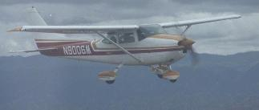

# Ed Williams' Aviation page.

**My 182**

My [aviation formulary](avform.md) contains a fairly complete collection of great circle and rhumb line navigation formulae. It also contains standard atmosphere properties and E6B functions. A pure Ascii version is available for [ftp download](http://edwilliams.org/avform.txt). Some of the functions have been programmed into a Javascript [on-line calculator](http://edwilliams.org/gccalc.htm), some into an [Excel spreadsheet](http://edwilliams.org/ftp/avsig/avform.xls).

A Mercator (rhumb-line) calculator for WGS84 is [here](http://edwilliams.org/msail_mod.html). A beginning on a (mathematical!) primer on navigation on an ellipsoidal earth is [here](http://edwilliams.org/ellipsoid/ellipsoid.html). I'm planning on getting this finished sometime...

A discussion of compass errors, with formulae is [here](http://edwilliams.org/compass/compass.html).

I've written software that computes magnetic variation anywhere on (or above) the earth's surface, using either the WMM or IGRF reference models. There are [Mac](http://edwilliams.org/ftp/avsig/magmac.sit) , [DOS](http://edwilliams.org/ftp/avsig/magdos.zip) , [linux](http://edwilliams.org/ftp/avsig/magvarlinux) , and [Java](http://edwilliams.org/ftp/avsig/magfield.jav) executables available by ftp. A web calculator is [here](http://edwilliams.org/magvar.html) . C source code released under the GPL is [here](http://edwilliams.org/ftp/avsig/magfieldsrc.tar.gz) , in Visual Basic (courtesy Ian Billing) [here](http://edwilliams.org/ftp/avsig/MAGVARVB.ZIP) .

[Francisco Bernal](http://www.easynav.com/) has adapted the code to make a Windows version with an interactive map interface [here](http://edwilliams.org/ftp/avsig/magvarw3.zip) . It comes with source code and a dll. [16bit version](http://edwilliams.org/ftp/avsig/magvarw.zip) .

My favorite [weather briefing](http://edwilliams.org/weather/weather.html) links. (I open a collection of them in tabs, using the Mozilla browser. Try it. You'll like it, provided you have a fast Internet connection.

Some reading matter:

- [A diary of a recent trip to Alaska](http://edwilliams.org/alaska.html)
- [Mountain flying for flatland airplanes](http://edwilliams.org/smxgigpdf/mountfall.pdf). from SMXGIG 1996.
- [Energy management and the pitch/power controversy](http://edwilliams.org/smxgigpdf/smxgig97.html) Viewgraphs of a one hour presentation at SMXGIG97. Not yet annotated with what I said- someday...
- [Flying in ice](http://edwilliams.org/smxgigpdf/smxgig98.html).  
Viewgraphs from a one hour presentation at SMXGIG98. Not annotated either... It's a 1.3MB file.
- [Aerodynamics of the glide](http://edwilliams.org/smxgigpdf/smxgig99.html)  
A one hour presentation at SMXGIG99. Not annotated...
- [Just how high are we?](http://edwilliams.org/smxgigpdf/smxgig2000.html)  
Another one hour presentation at SMXGIG2000 on altimetry. Not annotated...
- [VFR and IFR options](http://edwilliams.org/smxgigpdf/smx2001a.pdf)  
\- from SMXGIG 2001
- [Procedure turns](http://edwilliams.org/smxgigpdf/smx2001b.pdf)  
\- from SMXGIG 2001
- [Pressure Pattern Navigation](http://edwilliams.org/smxgigpdf/smx2001c.pdf)  
\- from SMXGIG 2001
- [Cloud physics and meteorology](http://edwilliams.org/smxgigpdf/smxgig2002.pdf)  
\- from SMXGIG 2002 (2.4MB)
- [Atmospheric stability. A pilot's primer](http://edwilliams.org/smxgigpdf/smx2003.pdf)  
\- from SMXgig 2003 (890Kb)
- [A mathematical analysis of turns around a point in a wind.](http://edwilliams.org/turnsaroundapoint.pdf)
- [GPS - How it works and how to work it.](http://edwilliams.org/smxgigpdf/smx2004/index.htm)  
\- from SMXgig 2004 (ppt->html)
- [How to do an impromptu hold](http://edwilliams.org/holding/index.htm)  
(ppt->html)
- [C172RG](http://edwilliams.org/172RG_POH/electrical_172RG.pdf) electrical system (simplified)
- [1980 C172RG POH](http://edwilliams.org/172RG_POH/cover.html)
- [C172RG systems quiz](http://edwilliams.org/172RG_POH/c172rgquiz.txt)
- [1966 Mooney M20E (Super 21) POH](http://edwilliams.org/m20e/m20epoh.pdf)
- [1966 Mooney M20E systems](http://edwilliams.org/m20e/mooneysys.pdf)
- [IFR departure decision tree](http://edwilliams.org/ifrdeptree.pdf)  
(from Eckalbar's Structured IFR}
- [WAAS it all about?](http://edwilliams.org/waas.pdf)  
[(from SMXgig 2007)](http://edwilliams.org/waas.pdf)
- [Mountain Flying](http://edwilliams.org/smxgigpdf/mfly2.pdf)  
[(from FPI July 2007)](http://edwilliams.org/smxgigpdf/mfly2.pdf)
- [Spin Seminar](http://edwilliams.org/spin_seminar.pdf)  
[(Evan Reed's aug 07 FPI talk)](http://edwilliams.org/spin_seminar.pdf)
- [Weather in the vertical.](http://edwilliams.org/fpi/Atmospheric_StabilityFPI.pdf) Feb/March 2008 talk at [FPI](http://www.flyingparticles.org/) (adapted from my 2004/6 talks at SMX)  
[MP3](http://edwilliams.org/fpi/Skewt.mp3) audio of this talk, courtesy of Jay Cotton and [LBMG](http://lbmgmusic.us/) music. (30mb download!) ([Zipped](http://edwilliams.org/fpi/skew-t.zip) version - 27mb)
- [Flying the Garmin G1000](http://edwilliams.org/smxgigpdf/smx_g1000.pdf)  
An intro to glass panels. (SMXGIG 2008)
- [The impossible turn. (Returning to the airort after engine failure)](http://edwilliams.org/turnback_seminar_Oct_2008.pdf) (Evan Reed's Oct 2008 FPI talk)

Some other files that may be of interest are available in my [ftp directory](http://edwilliams.org/ftp/avsig/)

[oral.zip](http://edwilliams.org/ftp/avsig/oral.zip)  
A fairly comprehensive quiz for an IFR flight test or ICC (updated May 2004)  
[mountain.zip](http://edwilliams.org/ftp/avsig/mountain.zip)  
A mountain flying quiz.  
[pic.txt](http://edwilliams.org/ftp/avsig/pic.txt)  
Some FAA legal opinions on the logging of PIC time.  
[endrse.zip](http://edwilliams.org/ftp/avsig/endrse.zip)  
Text of recommended flight instructor endorsements.  
[wetbulb.zip](http://edwilliams.org/ftp/avsig/wetblb.zip)  
An Excel spreadsheet relating relative humidity, dewpoint and wet bulb temperature.  
[prop.xls](http://edwilliams.org/ftp/avsig/prop.xls)  
An Excel spreadsheet implementing a simple model of a constant speed prop.  
[palt.pdf](http://edwilliams.org/palt.pdf)  
Pressure altitude vs. mbar pressure. I use it to get freezing levels (FRZ) from [RAOB skew_T plots](http://weather.unisys.com/upper_air/skew/)  
[Areanav](http://edwilliams.org/ftp/avsig/areanav1.xls)  
An Excel spreadsheet that creates a "road-map" style table of distances and bearings between airports. Created by another pilot using the Formulary! Enter your own airports.  
[geocalc.xls](http://home.gci.net/~glen/index.html)  
An Excel 2000 spreadsheet by Glen Denning, with a user-friendly interface. It has a variety of great-circle navigation functions and interacts with a database of navigation fixes (VOR and Intersections supplied). Look under "downloads".

[Miscellaneous links](http://edwilliams.org/links.html)

An (ex-) IFR student's [checkride story](http://www.crl.com/~olewis/IFR.html).

Joe Campbell's [IFR diary](http://www.campbells.org/Airplanes/Diary/toc.html) -in which I also feature!

[Ed Williams](http://edwilliams.org/contact.html) is a 4200+ hr ATP-MEL Comm-SEL CFII. He owns a C182 based in Livermore CA. He developed and taught weekend ground schools for Aviation Seminars. He specializes in IFR instruction out of HWD and LVK.