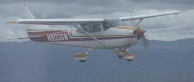

# Ed Williams的航空主页
[原始页面](http://edwilliams.org/) | [Backup of original English version](../en-us/index.md)

**我的182飞机**

我的[航空公式集](avform.md)包含相当完整的大圆航法和等角航法导航公式集合。它还包含标准大气特性和E6B功能。纯Ascii版本可以从[ftp下载](http://edwilliams.org/avform.txt)。其中一些功能已编程为Javascript[ 在线计算器](http://edwilliams.org/gccalc.htm)，另一些功能已编程为[Excel电子表格](http://edwilliams.org/ftp/avsig/avform.xls).

WGS84的墨卡托（等角航法）计算器[在此](http://edwilliams.org/msail_mod.html)。关于在椭圆形地球上导航的（数学的！）入门[在此](http://edwilliams.org/ellipsoid/ellipsoid.html)。我打算在未来某个时候完成此工作......

指南针误差的公式讨论[在此](http://edwilliams.org/compass/compass.html).

我编写了使用WMM或IGRF参考模型来计算地球表面上（或上方）任何地方的磁变化的软件。ftp提供了[Mac](http://edwilliams.org/ftp/avsig/magmac.sit)，[DOS](http://edwilliams.org/ftp/avsig/magdos.zip)，[linux](http://edwilliams.org/ftp/avsig/magvarlinux)和[Java](http://edwilliams.org/ftp/avsig/magfield.jav)可执行文件。网络计算器[在此](http://edwilliams.org/magvar.html)。
在GPL下发布的C源代码[在此](http://edwilliams.org/ftp/avsig/magfieldsrc.tar.gz)，Visual Basic版本[在此](http://edwilliams.org/ftp/avsig/MAGVARVB.ZIP)（由Ian Billing提供）。

[Francisco Bernal](http://www.easynav.com/)修改了代码，以制作具有交互式地图界面的Windows版本[见此](http://edwilliams.org/ftp/avsig/magvarw3.zip)。它带有源代码和一个dll。[16位版本](http://edwilliams.org/ftp/avsig/magvarw.zip)

我最喜欢的[天气简报](http://edwilliams.org/weather/weather.html)链接。（我使用Mozilla浏览器在选项卡中打开它们的集合。尝试一下。只要你具有快速的Internet连接，便会喜欢它。

一些阅读事项：

- [A diary of a recent trip to Alaska](http://edwilliams.org/alaska.html)
- [Mountain flying for flatland airplanes](http://edwilliams.org/smxgigpdf/mountfall.pdf). from SMXGIG 1996.
- [Energy management and the pitch/power controversy](http://edwilliams.org/smxgigpdf/smxgig97.html) Viewgraphs of a one hour presentation at SMXGIG97. Not yet annotated with what I said- someday...
- [Flying in ice](http://edwilliams.org/smxgigpdf/smxgig98.html).  
Viewgraphs from a one hour presentation at SMXGIG98. Not annotated either... It's a 1.3MB file.
- [Aerodynamics of the glide](http://edwilliams.org/smxgigpdf/smxgig99.html)  
A one hour presentation at SMXGIG99. Not annotated...
- [Just how high are we?](http://edwilliams.org/smxgigpdf/smxgig2000.html)  
Another one hour presentation at SMXGIG2000 on altimetry. Not annotated...
- [VFR and IFR options](http://edwilliams.org/smxgigpdf/smx2001a.pdf)  
\- from SMXGIG 2001
- [Procedure turns](http://edwilliams.org/smxgigpdf/smx2001b.pdf)  
\- from SMXGIG 2001
- [Pressure Pattern Navigation](http://edwilliams.org/smxgigpdf/smx2001c.pdf)  
\- from SMXGIG 2001
- [Cloud physics and meteorology](http://edwilliams.org/smxgigpdf/smxgig2002.pdf)  
\- from SMXGIG 2002 (2.4MB)
- [Atmospheric stability. A pilot's primer](http://edwilliams.org/smxgigpdf/smx2003.pdf)  
\- from SMXgig 2003 (890Kb)
- [A mathematical analysis of turns around a point in a wind.](http://edwilliams.org/turnsaroundapoint.pdf)
- [GPS - How it works and how to work it.](http://edwilliams.org/smxgigpdf/smx2004/index.htm)  
\- from SMXgig 2004 (ppt->html)
- [How to do an impromptu hold](http://edwilliams.org/holding/index.htm)  
(ppt->html)
- [C172RG](http://edwilliams.org/172RG_POH/electrical_172RG.pdf) electrical system (simplified)
- [1980 C172RG POH](http://edwilliams.org/172RG_POH/cover.html)
- [C172RG systems quiz](http://edwilliams.org/172RG_POH/c172rgquiz.txt)
- [1966 Mooney M20E (Super 21) POH](http://edwilliams.org/m20e/m20epoh.pdf)
- [1966 Mooney M20E systems](http://edwilliams.org/m20e/mooneysys.pdf)
- [IFR departure decision tree](http://edwilliams.org/ifrdeptree.pdf)  
(from Eckalbar's Structured IFR}
- [WAAS it all about?](http://edwilliams.org/waas.pdf)  
[(from SMXgig 2007)](http://edwilliams.org/waas.pdf)
- [Mountain Flying](http://edwilliams.org/smxgigpdf/mfly2.pdf)  
[(from FPI July 2007)](http://edwilliams.org/smxgigpdf/mfly2.pdf)
- [Spin Seminar](http://edwilliams.org/spin_seminar.pdf)  
[(Evan Reed's aug 07 FPI talk)](http://edwilliams.org/spin_seminar.pdf)
- [Weather in the vertical.](http://edwilliams.org/fpi/Atmospheric_StabilityFPI.pdf) Feb/March 2008 talk at [FPI](http://www.flyingparticles.org/) (adapted from my 2004/6 talks at SMX)  
[MP3](http://edwilliams.org/fpi/Skewt.mp3) audio of this talk, courtesy of Jay Cotton and [LBMG](http://lbmgmusic.us/) music. (30mb download!) ([Zipped](http://edwilliams.org/fpi/skew-t.zip) version - 27mb)
- [Flying the Garmin G1000](http://edwilliams.org/smxgigpdf/smx_g1000.pdf)  
An intro to glass panels. (SMXGIG 2008)
- [The impossible turn. (Returning to the airort after engine failure)](http://edwilliams.org/turnback_seminar_Oct_2008.pdf) (Evan Reed's Oct 2008 FPI talk)

我的[ftp目录](http://edwilliams.org/ftp/avsig/)中提供了其他一些你可能感兴趣的文件。

[oral.zip](http://edwilliams.org/ftp/avsig/oral.zip)  
A fairly comprehensive quiz for an IFR flight test or ICC (updated May 2004)  
[mountain.zip](http://edwilliams.org/ftp/avsig/mountain.zip)  
A mountain flying quiz.  
[pic.txt](http://edwilliams.org/ftp/avsig/pic.txt)  
Some FAA legal opinions on the logging of PIC time.  
[endrse.zip](http://edwilliams.org/ftp/avsig/endrse.zip)  
Text of recommended flight instructor endorsements.  
[wetbulb.zip](http://edwilliams.org/ftp/avsig/wetblb.zip)  
An Excel spreadsheet relating relative humidity, dewpoint and wet bulb temperature.  
[prop.xls](http://edwilliams.org/ftp/avsig/prop.xls)  
An Excel spreadsheet implementing a simple model of a constant speed prop.  
[palt.pdf](http://edwilliams.org/palt.pdf)  
Pressure altitude vs. mbar pressure. I use it to get freezing levels (FRZ) from [RAOB skew_T plots](http://weather.unisys.com/upper_air/skew/)  
[Areanav](http://edwilliams.org/ftp/avsig/areanav1.xls)  
An Excel spreadsheet that creates a "road-map" style table of distances and bearings between airports. Created by another pilot using the Formulary! Enter your own airports.  
[geocalc.xls](http://home.gci.net/~glen/index.html)  
An Excel 2000 spreadsheet by Glen Denning, with a user-friendly interface. It has a variety of great-circle navigation functions and interacts with a database of navigation fixes (VOR and Intersections supplied). Look under "downloads".

[杂项链接](http://edwilliams.org/links.html)

一个（前）IFR学生的[飞行检查故事](http://www.crl.com/~olewis/IFR.html)。

Joe Campbell的[IFR日记](http://www.campbells.org/Airplanes/Diary/toc.html)-其中我也参与了！

[Ed Williams](http://edwilliams.org/contact.html)是一个具有4200+小时 ATP-MEL Comm-SEL 的CFII注册飞行仪表教练。他在加利福尼亚利佛摩有一架C182。他为Aviation Seminars开发和教授周末地面学校课程。He specializes in IFR instruction out of HWD and LVK.